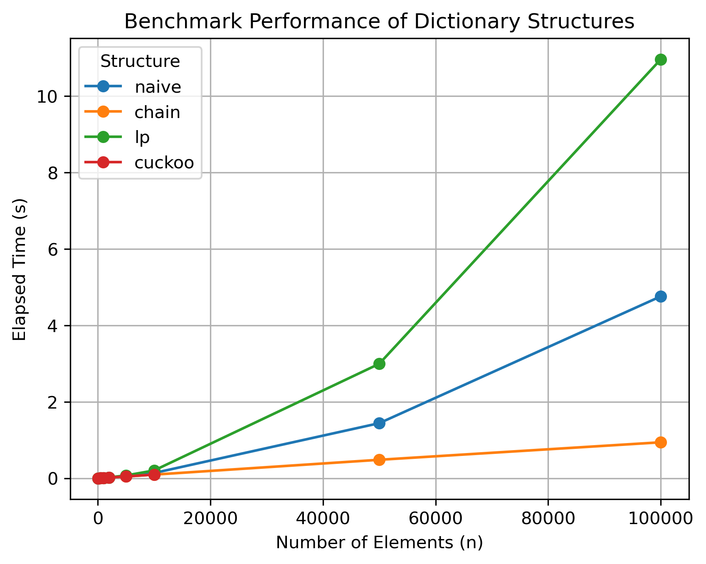

# Hash-Table-Implementations

## Overview

This project implements and compares the performance between four different dictionary data structures, focusing on their efficiency and use cases. The four structures are: 

1. **Naive Dictionary**: Uses an unsorted vector for key-value entries.
2. **Chaining Hash Table**: Implements separate chaining for collision resolution.
3. **Linear Probing Hash Table**: Resolves collisions via linear probing.
4. **Cuckoo Hash Table**: Uses multiple hash functions and moves items to resolve collisions.

## Features

- **Hash Structures Implemented**:
  - Naive
  - Chain
  - Linear Probing (LP)
  - Cuckoo
- **Benchmarking Tool**:
  - Times the `set` and `search` operations.
- **Data Visualization**:
  - Comparison scatter plots of performance across data structures.

## Performance Results

### Scatter Plots

#### Performance of Chain, LP, and Cuckoo

### Adjusted Insights

Using the benchmark data provided, the following observations were made:

1. **Performance Rankings**:
   - **Fastest**: `Cuckoo` and `Chain` (pretty much tied, except for large `n`.).
   - **Moderate**: `Linear Probing` (slower than chaining/cuckoo, due to clustering effects as `n` increases).
   - **Slowest**: `Naive` (O(n) search complexity).

2. **Notable Observations**:
   - **Cuckoo Hashing**: Did not finish for very large `n`. The load factor becomes too high, so there becomes an almost guranteed chance to encounter cycles.
   - **Linear Probing**: Struggles with increased input sizes, as collision handling affects performance.
   - **Chaining**: Offers excellent performance and is easier to implement compared to `cuckoo`.
   - **Naive**: Significantly slower than all hash-based structures, as expected from its unsorted vector approach.

## Trade-Offs

- **Best Trade-Off**: `Chaining` offers a balance of ease of implementation and performance.
- **Optimal Performance**: `Cuckoo` hashing is ideal when considering rehashing with a new hash function or managing load factors. This, however, comes with increased implementation complexity.
- **Simplest Implementation**: `Naive` is the easiest to implement but lacks practical performance.

## License

MIT License. See `LICENSE` file for details.

